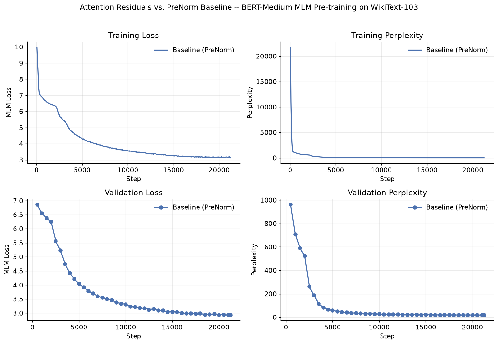

# attn-res-bert

A small, from-scratch PyTorch research library that isolates and benchmarks
**Attention Residuals (AttnRes)** -- the residual architecture used in Kimi K3 
from the Kimi Team, ["Attention Residuals" technical report](https://arxiv.org/abs/2603.15031) 
-- against a standard PreNorm residual baseline, inside an 8-layer 
BERT-Medium-sized encoder trained on masked language modeling over WikiText-103.

## What's being tested

Standard PreNorm Transformers accumulate every layer's output with a fixed,
unit-weight additive residual: `h_l = h_{l-1} + f(LN(h_{l-1}))`. AttnRes
replaces that fixed accumulation with **learned softmax attention over the
entire history** of previous sublayer outputs:

```
phi(q, k)    = exp( q · RMSNorm(k) )
alpha_{i->l} = softmax_i( phi(w_l, v_i) )
h_l          = sum_i alpha_{i->l} · v_i
```

where `v_0` is the token embedding, `v_i` is the raw output of sublayer `i`,
and `w_l` is a single **zero-initialized** learned pseudo-query per sublayer
(so training starts out equivalent to uniform averaging over history, and
only diverges as `w_l` learns). This repo implements *Full* AttnRes (attends
over every preceding sublayer, not the memory-saving block-wise variant) as a
drop-in toggle on an otherwise identical architecture, so any performance
delta is attributable to the residual mechanism alone.

## Repo layout

```
attn-res-bert/
├── run_exp.py         # CLI entry point (argparse)
├── requirements.txt
└── src/
    ├── modeling.py    # BertConfig, TransformerLayer, AttentionResidualMix, BertForMaskedLM
    ├── dataset.py     # WikiText-103 loading/packing + dynamic MLM masking collator
    └── training.py    # mixed-precision training loop, optimizer/scheduler, eval
```

## Quickstart (Google Colab)

```bash
!git clone <this-repo-url>
%cd attn-res-bert
!pip install -q -r requirements.txt

# Baseline: standard PreNorm identity residuals
!python run_exp.py --model_variant baseline --epochs 3 --batch_size 32 --lr 3e-4

# Full Attention Residuals
!python run_exp.py --model_variant attn_res --epochs 3 --batch_size 32 --lr 3e-4
```

Each run writes `checkpoints/<run_name>/{config.json, history.json, model.pt}`,
so `history.json` from both runs can be loaded side-by-side to plot loss /
perplexity curves.

## Results
 
Once at least one variant has finished training, generate the comparison
plot and fairness table with:
 
```bash
python plot_results.py
```
 
This reads `<checkpoint_dir>/{baseline,attn_res}/{history.json,fairness_report.json}`,
gracefully skips whichever variant hasn't finished yet, and saves
`attn_res_vs_baseline.png` plus a printed table of params / est. FLOPs-per-step
/ tokens-per-sec / wall clock for each available run. Optional flags:
`--checkpoint_dir` (default `checkpoints`) and `--output` (default
`attn_res_vs_baseline.png`).
 



## Notes on scale

Defaults are intentionally sized for a single Colab T4: BERT-Medium
dimensions (`hidden=512`, `layers=8`, `heads=8`, `ffn=2048`), 256-token packed
sequences, and fp16 mixed precision. This is a *mechanism-isolation*
benchmark, not a reproduction of the paper's 48B-parameter / 1.4T-token
result — expect the gap between variants at this scale to be modest, which is
itself part of what makes the comparison a useful, fast sanity check.
